# Habit Tracker

## Idea

Given a user's goals, projects, task history, notes, and activity data, automatically determine the highest-impact work they should perform today and explain why.

## Executive Summary

- Using Retrieval-Augmented Generation (RAG) and advanced AI capabilities, the system understands the user's goals, project history, completed work and learning progress. Based on this knowledge, it automatically generates personalized to-do lists, recommends next actions, prioritizes tasks, identifies bottlenecks, and provides intelligent guidance to keep users focused on their objectives.
- The platform continuously collects metrics across projects, habits, learning activities, productivity and goal progress converting raw activity data into actionable insights. AI-powered analytics help users understand performance trends, measure progress, predict goal completion, and discover opportunities for improvement.
- The result is a comprehensive Personal Growth Operating System that acts as a productivity platform

## Tech Stack

- **Frontend**: Tauri, React, Vite, shadcn
- **Backend**: Python
- **Database**: Qdrant, supabase

## Architecture Design
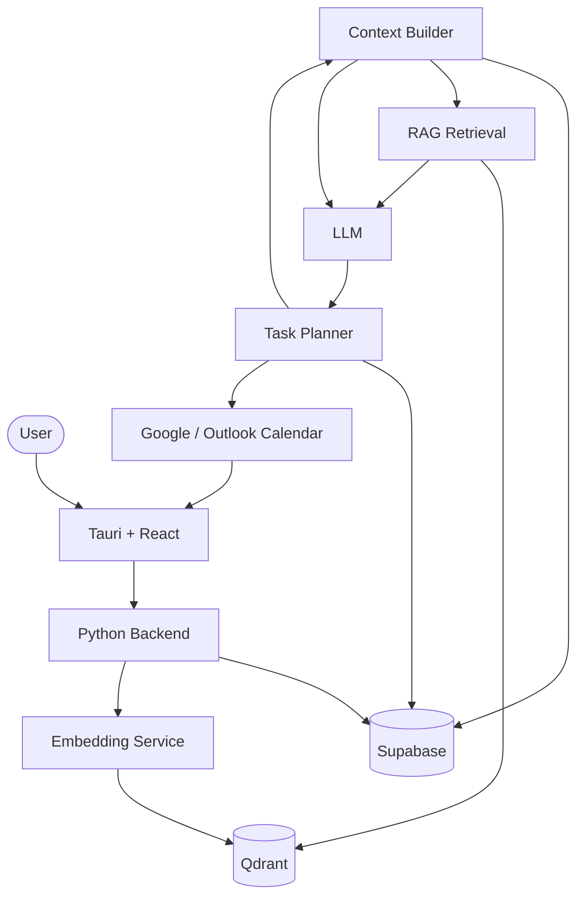
## Main Planning Flow
This is essentially the entire product.
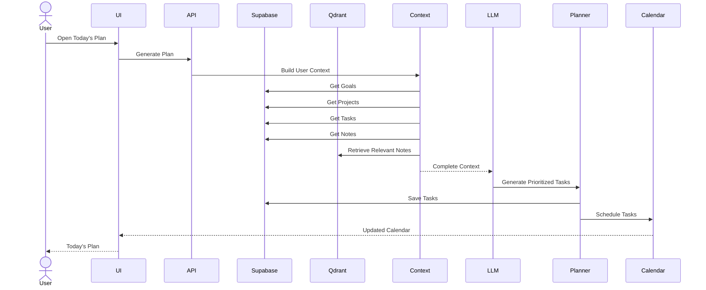
## Data Model
````
Goal
 └── Project
      └── Task

Notes
 └── Embeddings
      └── Qdrant

Task
 ├── title
 ├── priority
 ├── estimated_duration
 ├── due_date
 ├── status
 ├── project_id
 └── calendar_event_id
 ````
## Actual AI Flow
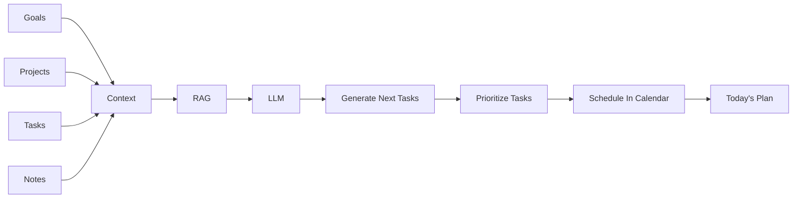
# Epic wise archeitecture
## Epic 1: Foundation & Infrastructure

**Goal:** Create the application skeleton and backend foundation.

### Scope

* Tauri application setup
* React frontend setup
* Python backend setup
* Supabase integration
* Qdrant integration
* Authentication
* API layer
* Environment configuration

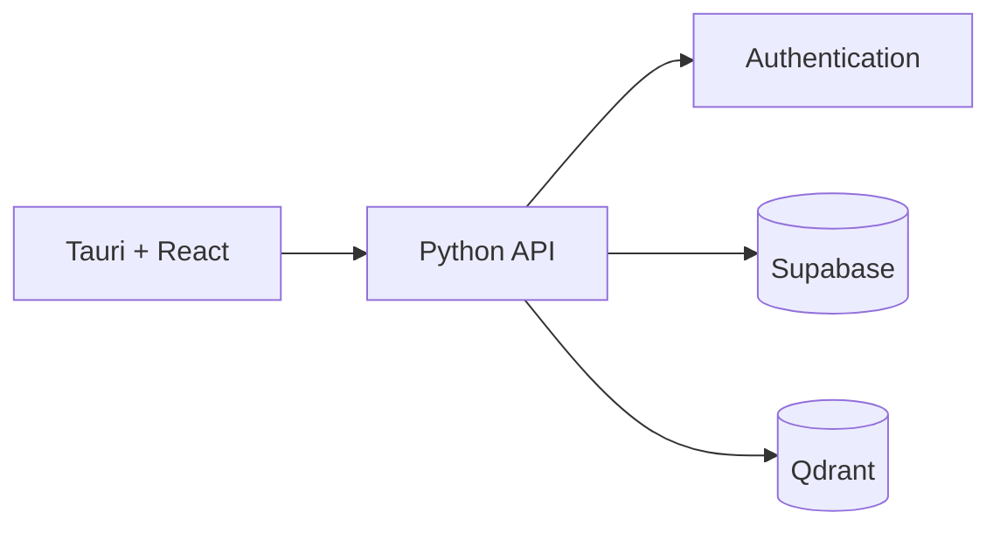

---

## Epic 2: Knowledge Capture

**Goal:** Store all user information that becomes planning context.

### Entities

* Goals
* Projects
* Notes

### Scope

* CRUD Goals
* CRUD Projects
* CRUD Notes
* Embedding generation
* Vector storage

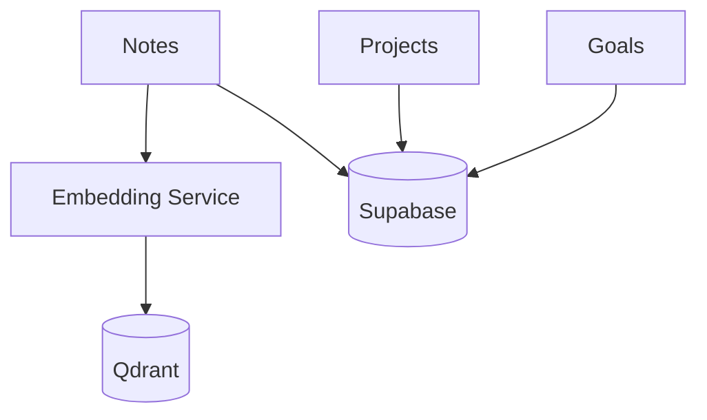

---

## Epic 3: Task Management

**Goal:** Manage executable work items.

### Scope

* Task CRUD
* Task status
* Task dependencies
* Due dates
* Priority
* Completion tracking

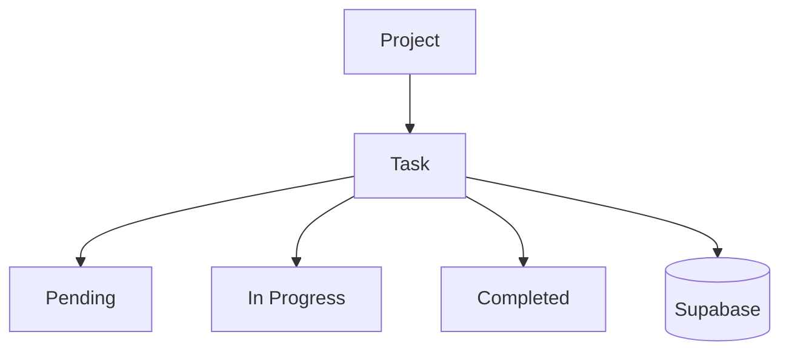

---

## Epic 4: Context Engine

**Goal:** Build the complete user state before AI execution.

### Inputs

* Goals
* Projects
* Tasks
* Notes
* Task completion history

### Output

* AI Context Package

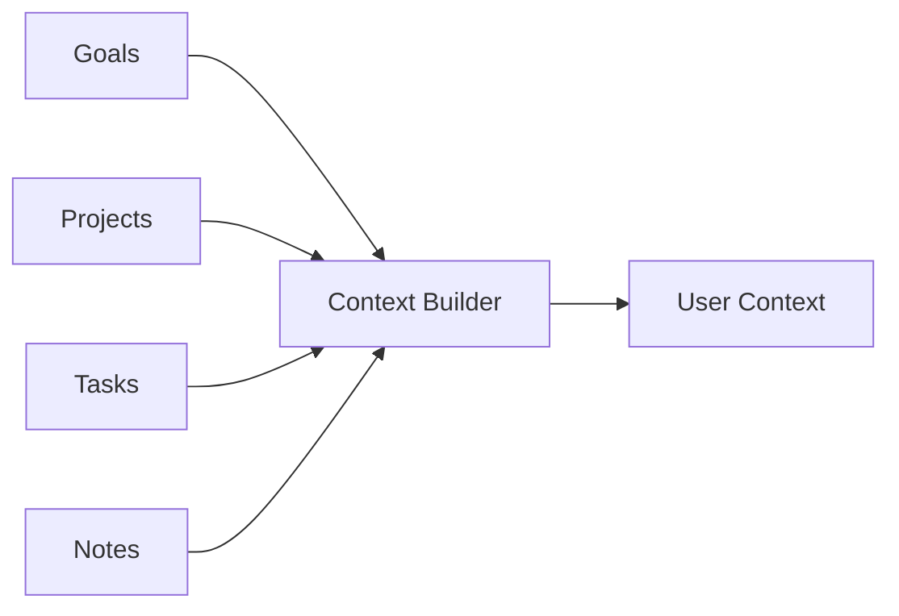

---

## Epic 5: RAG Engine

**Goal:** Retrieve relevant knowledge before planning.

### Scope

* Embedding generation
* Similarity search
* Context retrieval
* Context ranking

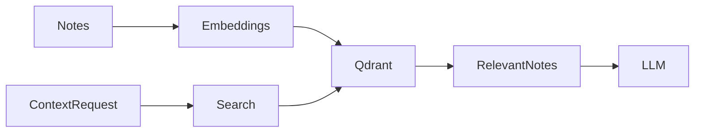

---

## Epic 6: AI Planning Engine (Core Product)

This is the most important epic.

### Goal

Generate:

* Next tasks
* Task priorities
* Suggested execution order

### Input

* Goals
* Projects
* Existing Tasks
* Relevant Notes

### Output

* New Tasks

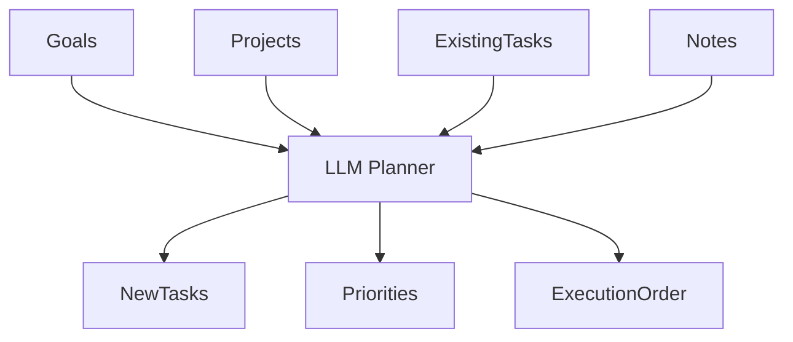

---

## Epic 7: Calendar Integration

**Goal:** Schedule generated tasks into the user's calendar.

### Scope

* Google Calendar
* Outlook Calendar
* Event creation
* Event updates
* Event deletion
* Calendar sync

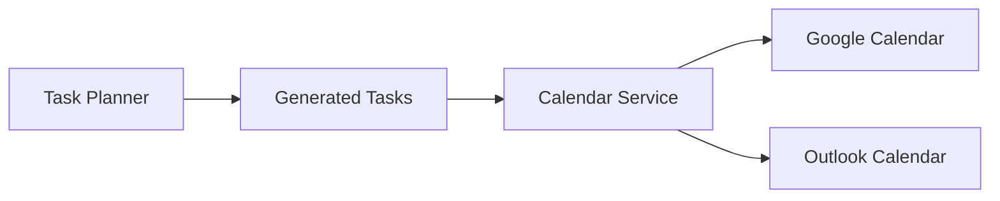

---

# Complete System View

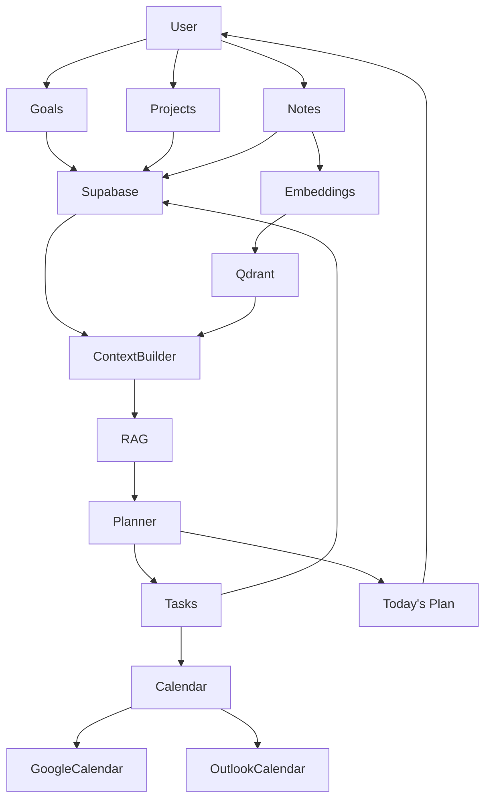

## Recommended Build Order

1. **Epic 1  Foundation**
2. **Epic 2  Knowledge Capture**
3. **Epic 3  Task Management**
4. **Epic 4  Context Engine**
5. **Epic 5  RAG Engine**
6. **Epic 6  AI Planning Engine**
7. **Epic 7  Calendar Integration**

Critical path:

```text
Foundation
    ↓
Data Models
    ↓
Task Management
    ↓
Context Builder
    ↓
RAG
    ↓
AI Planning
    ↓
Calendar
```

The AI Planning Engine is the product's differentiator; everything else exists to provide context and execute the plan.
