# Habit Tracker

## Idea

AI-powered platform that helps users capture ideas, create projects, manage goals, and track daily activities in one centralized workspace. Using RAG and AI, it understands user context, generates personalized tasks and action plans, and keeps daily work aligned with long-term objectives. The platform continuously analyzes performance metrics, productivity patterns, and progress to provide actionable insights that accelerate personal and professional growth.

## Executive Summary

- Using Retrieval-Augmented Generation (RAG) and advanced AI capabilities, the system understands the user's goals, project history, completed work, learning progress, and behavioral patterns. Based on this knowledge, it automatically generates personalized to-do lists, recommends next actions, prioritizes tasks, identifies bottlenecks, and provides intelligent guidance to keep users focused on their objectives.
- The platform continuously collects metrics across projects, habits, learning activities, productivity, and goal progress, converting raw activity data into actionable insights. AI-powered analytics help users understand performance trends, measure progress, predict goal completion, and discover opportunities for improvement.
- The result is a comprehensive Personal Growth Operating System that acts as both a productivity platform and an AI-powered personal coach, helping users turn ideas into projects, projects into achievements, and achievements into long-term growth.

## Teck Stack

- **Frontend**: Tauri, React, Vite, shadcn
- **Backend**: Python
- **Database**: SQLite

## Architecture Design
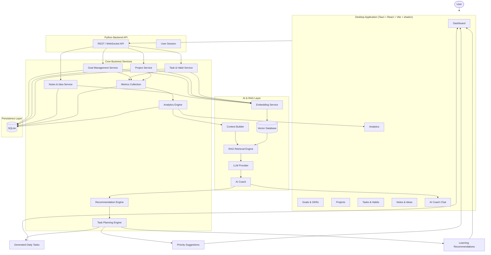

### 1. Idea Capture Module

**Purpose**: Convert thoughts into structured knowledge.

Data Stored
Raw note
Tags
Topics
Linked project
Timestamp
Embeddings

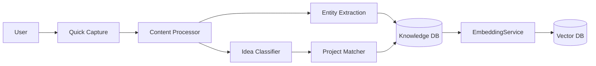
### 2. Goal Management Module

Purpose: Define long-term outcomes.

Data (Goal)

```
{
  "id": "",
  "title": "",
  "target_date": "",
  "status": "",
  "priority": ""
}
```
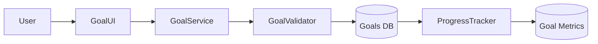
### 3. Project Management Module

Purpose: Convert goals into executable projects.

Data (Project)
```
{
  "id":"",
  "goal_id":"",
  "title":"",
  "status":"",
  "progress":""
}
```
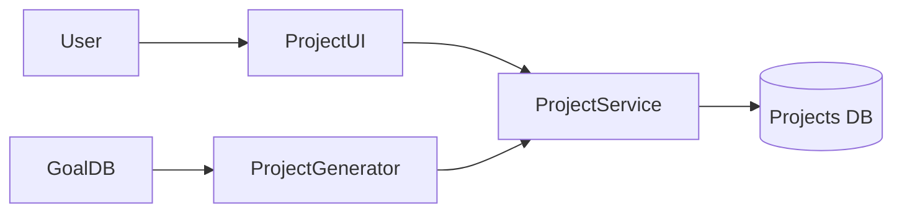
### 4. Task & Habit Module

Purpose: Daily execution.

Data (Task)
```
{
  "title":"",
  "priority":"",
  "due_date":"",
  "status":""
}
```
Data (Habit)
```
{
  "habit":"",
  "frequency":"",
  "streak":""
}
```
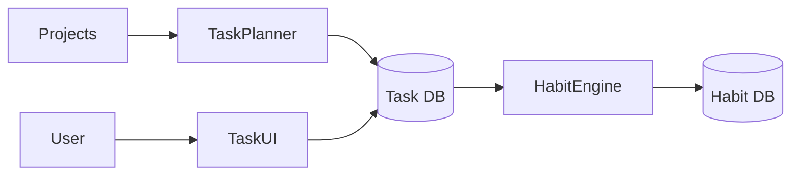
### 5. Context Engine

This is the heart of the system.

Purpose:

Build user context for AI
Output
```
{
  "active_goals":[],
  "active_projects":[],
  "overdue_tasks":[],
  "recent_notes":[],
  "learning_topics":[]
}
```
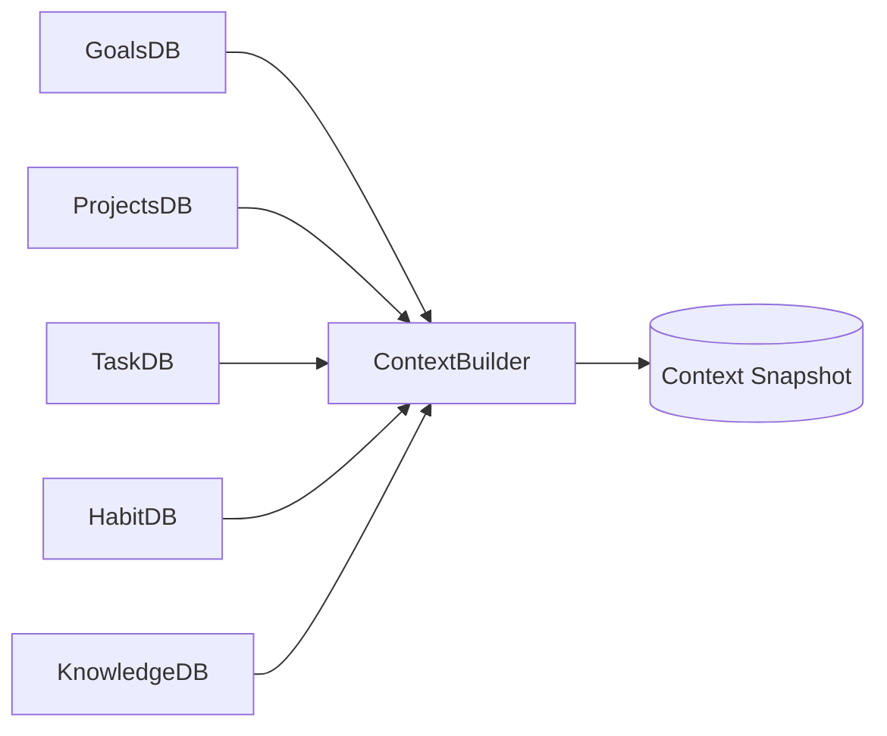
### 6. RAG Module

Purpose: Retrieve relevant information.

Flow

**Query:**
What should I work on today?

**Retrieve:**
- Goals
- Projects
- Tasks
- Notes
- Analytics

Send to LLM.
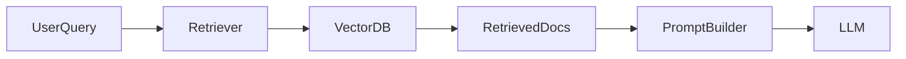

### 7. AI Planning Engine

Purpose: Generate work plan.

Output
```
{
  "today":[
    "Finish NLP lesson",
    "Review resume",
    "Apply to 2 jobs"
  ]
}
```
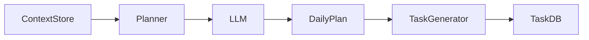
### 8. Recommendation Engine

Purpose: Suggest next actions.

Examples

You haven't worked on NLP for 5 days.
Resume project is blocked.
Goal completion probability decreased.
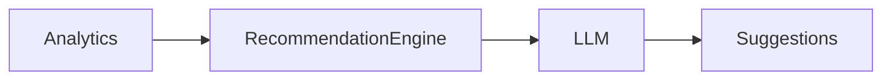
### 9. Analytics Module

Purpose: Convert activity into insights.

Metrics

Completion rate
Streaks
Focus time
Goal progress
Project velocity
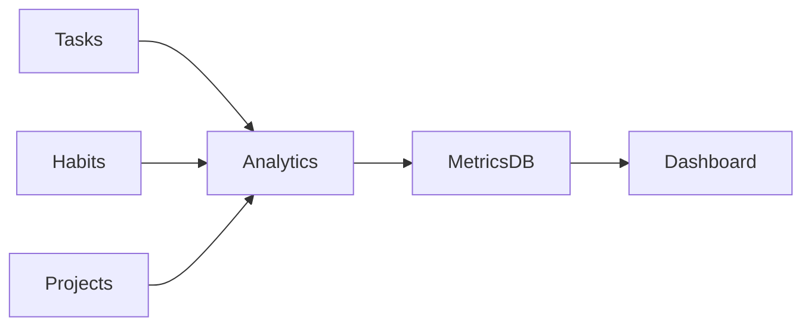
### 10. AI Coach Module

Purpose: User-facing assistant.

Examples

User:

Why am I not progressing?

AI receives:

goals
tasks
habits
notes
analytics

and explains bottlenecks.
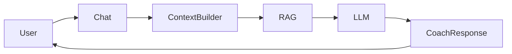
### 11. System-Wide Data Flow

This is the most important diagram.
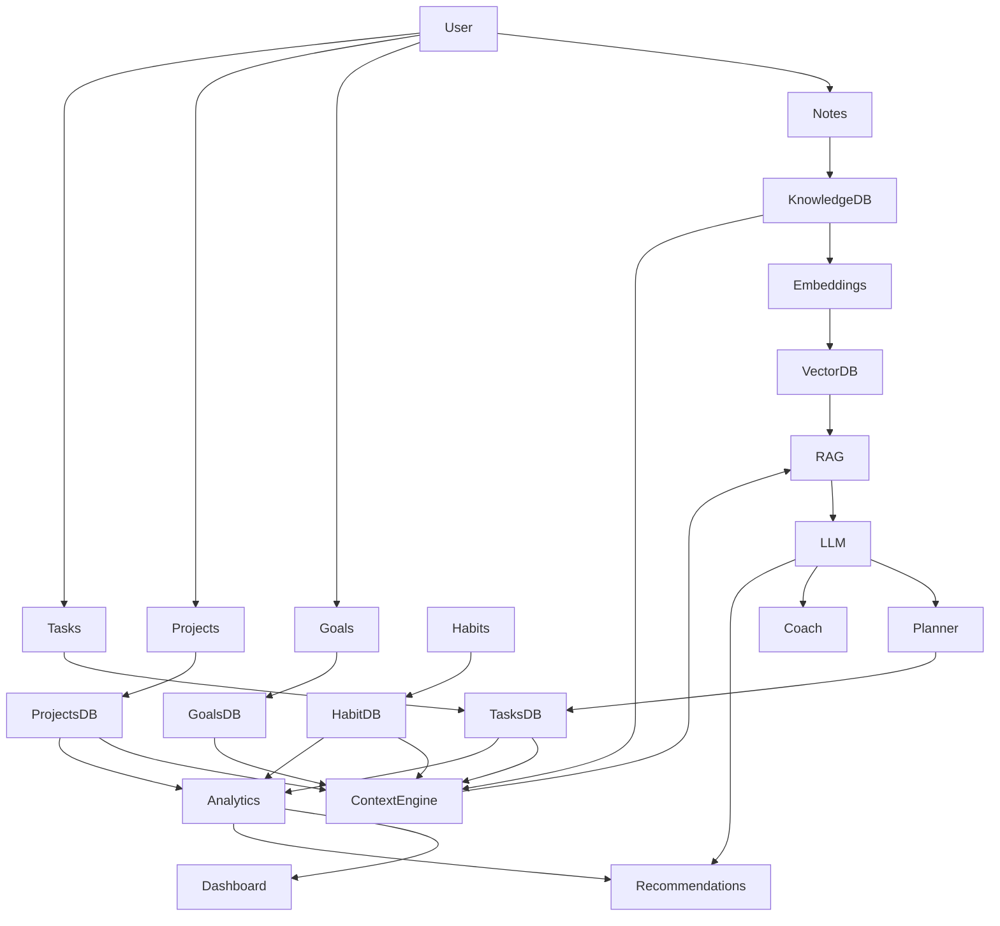


**Knowledge Graph** + Context Engine + Planning Engine

Idea
 → Goal
 → Project
 → Task
 → Completion
 → Analytics
 → Recommendation
 → Improved Goal Progress

## Sequential Diagram
For your system, a single sequence diagram is more valuable than dozens of component diagrams because it shows how data moves from the moment a user captures an idea until AI generates actions.

### 1. Capture Idea → Create Knowledge

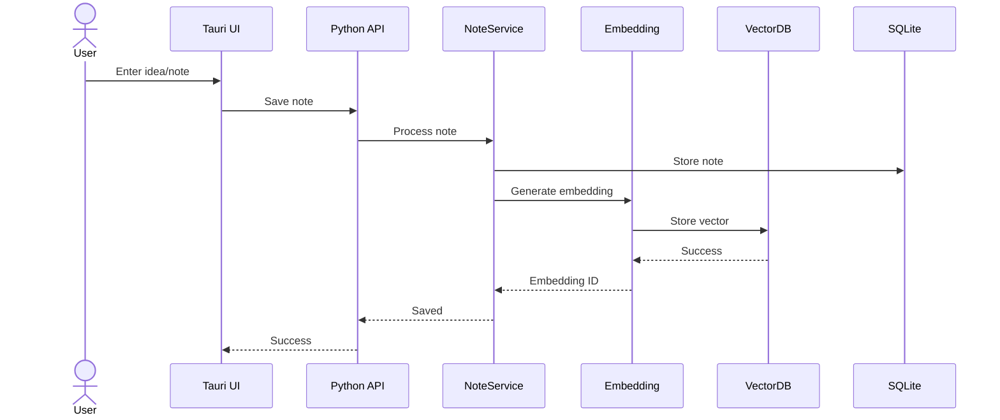

---

### 2. Goal → Project → Task Creation

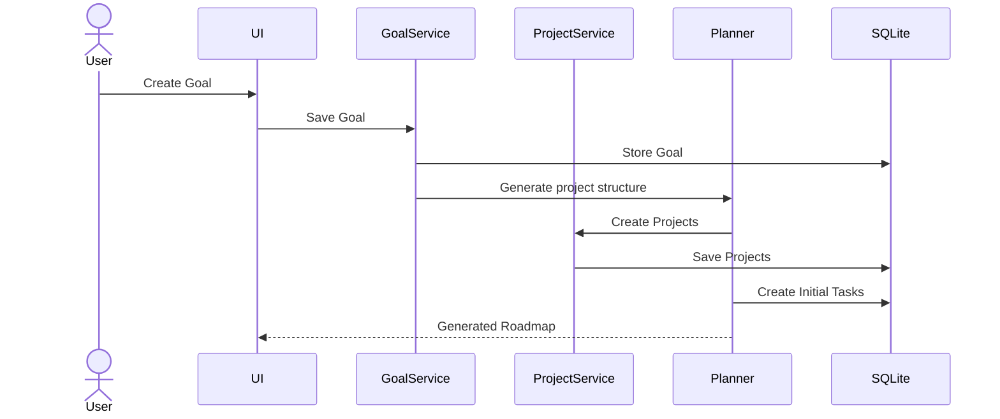

Example:

```text
Goal:
Get Data Scientist Job

Projects:
- Learn NLP
- Build Portfolio
- Apply Jobs

Tasks:
- Finish BERT Tutorial
- Update Resume
- Apply to 5 Companies
```

---

### 3. Daily Planning Flow (Core Feature)

This is your most important sequence.

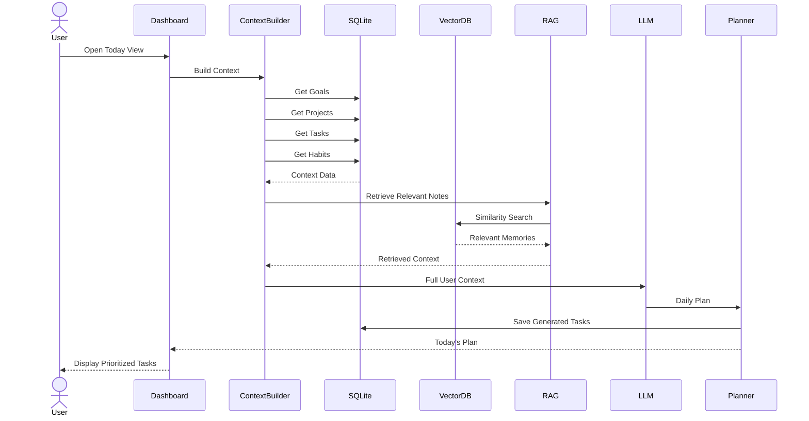

---

### 4. AI Coach Conversation

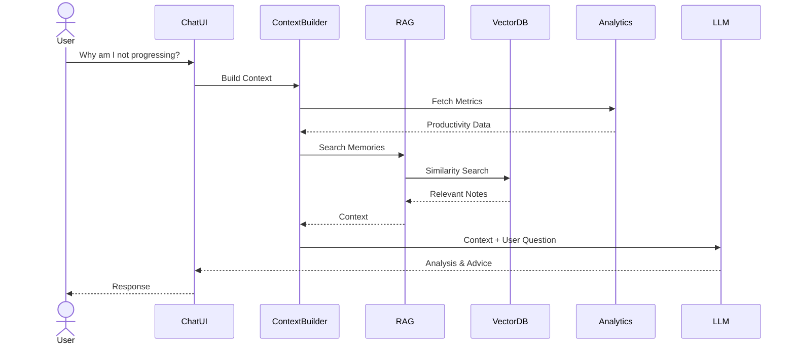

---

### 5. Task Completion Flow

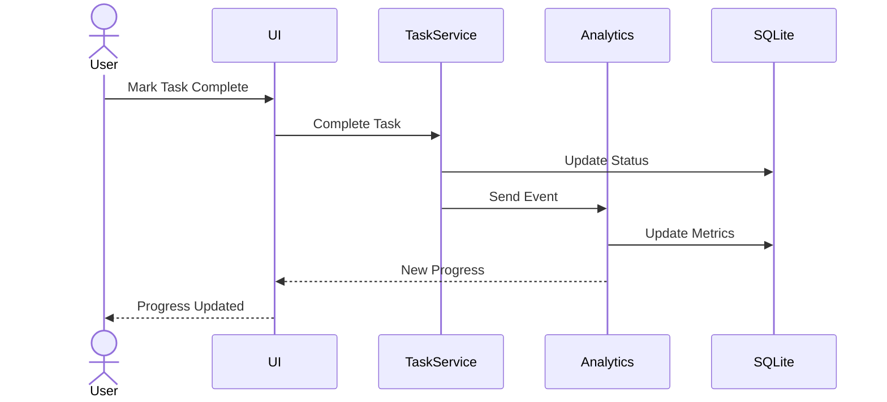

---

### 6. Recommendation Engine Flow

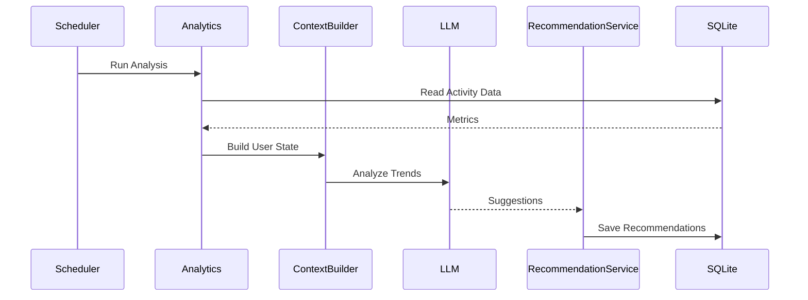

Example output:

```text
You haven't studied NLP for 7 days.

Resume project is stalled.

Goal completion probability dropped from 78% to 52%.

Suggested focus:
1. Resume update
2. NLP revision
3. Job applications
```

---

### 7. Complete End-to-End System Sequence

This is the "holy grail" flow.

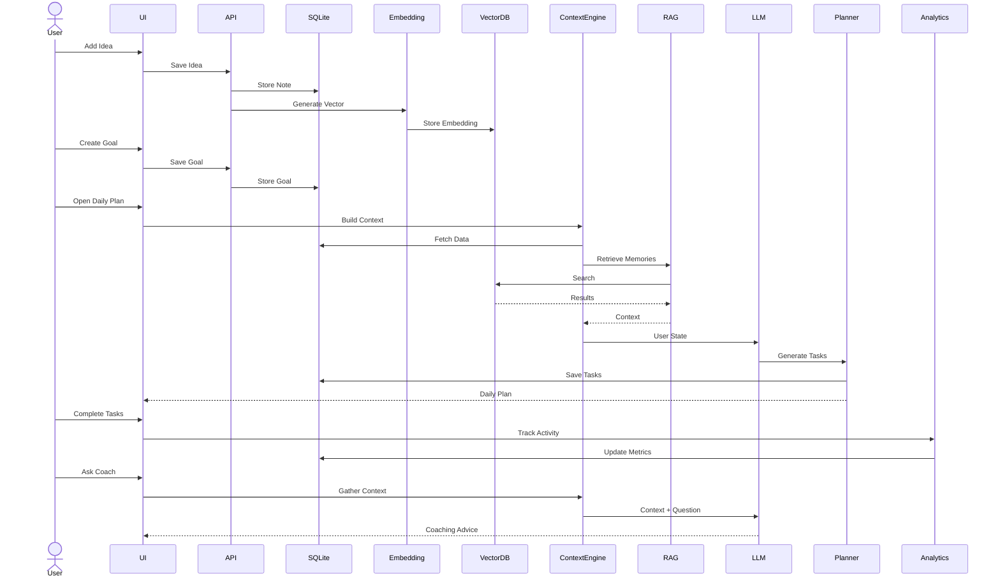

This sequence is essentially your entire product condensed into one flow:

**Capture → Store → Embed → Retrieve → Context Build → AI Planning → Execute → Analyze → Coach → Improve**.

## End Goal

The end goal of this product is:

1. **Act as a Personal Operating System** that centralizes goals, projects, habits, notes, learning, and daily execution into a single AI-driven workspace. 

2. **Convert ideas into outcomes automatically** by transforming captured thoughts into structured goals, projects, and actionable tasks. 

3. **Provide an AI-powered coach** that understands the user's complete context, identifies bottlenecks, recommends next actions, and keeps them aligned with long-term objectives. 

4. **Continuously learn from user behavior** through analytics, habits, task completion patterns, and project progress to improve future planning and recommendations. 

5. **Create a self-improving growth loop**:

```text
Capture → Organize → Plan → Execute → Analyze → Learn → Improve
```

so users achieve goals faster with less manual planning and decision-making. 
