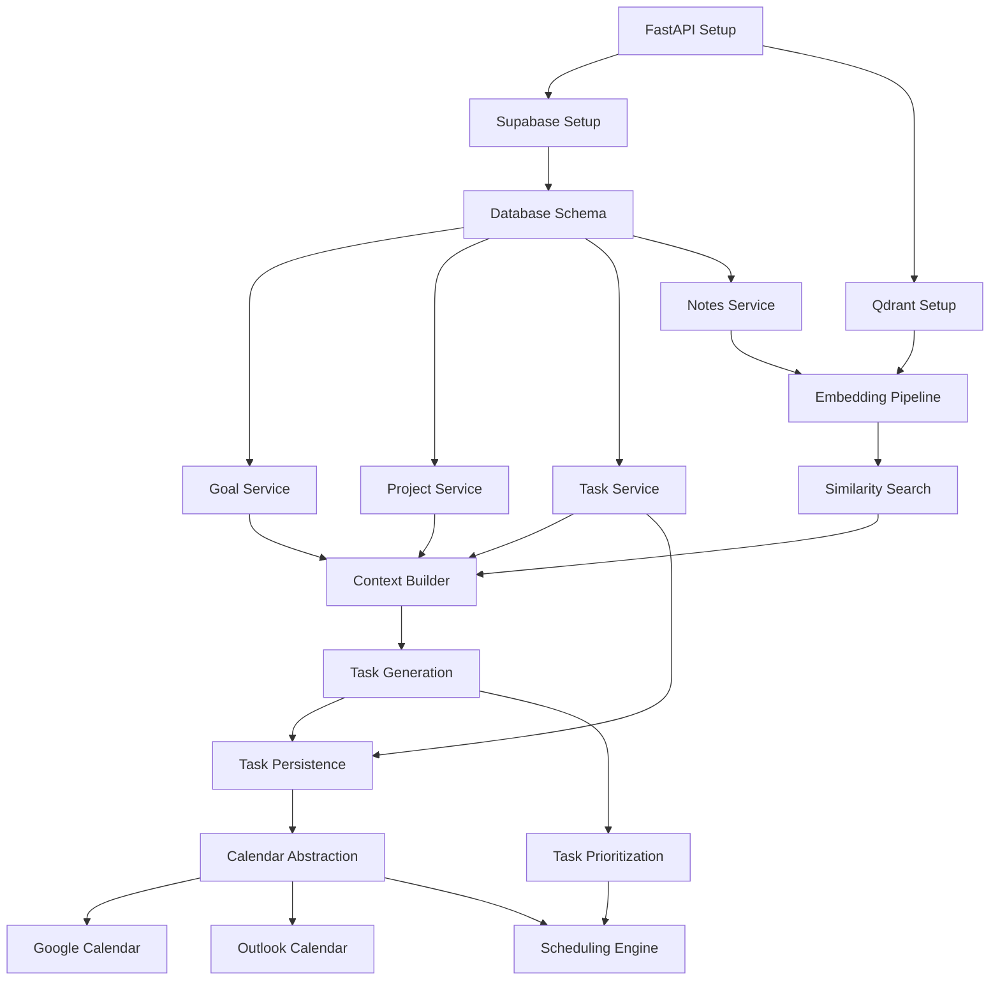

For this project, the backlog should be structured as a **dependency graph**, not by developer.

Example:

```text
Phase 1
├── Backend Foundation
├── Supabase Setup
├── Qdrant Setup
└── Database Schema

Phase 2
├── Goal Service
├── Project Service
├── Task Service
└── Notes Service

Phase 3
├── Embedding Pipeline
├── Retrieval Service
└── Context Builder

Phase 4
├── Planning Prompt Design
├── Task Generation
├── Task Prioritization
└── Task Persistence

Phase 5
├── Calendar Integration
├── Scheduling Engine
└── End-to-End Workflow
```

A better backlog would include:

| ID     | Task                   | Depends On         | Est. |
| ------ | ---------------------- | ------------------ | ---- |
| HT-001 | FastAPI Setup          | None               | S    |
| HT-002 | Supabase Setup         | HT-001             | S    |
| HT-003 | Database Schema        | HT-002             | M    |
| HT-004 | Qdrant Setup           | HT-001             | S    |
| HT-005 | Goal Service           | HT-003             | M    |
| HT-006 | Project Service        | HT-003             | M    |
| HT-007 | Task Service           | HT-003             | M    |
| HT-008 | Notes Service          | HT-003             | M    |
| HT-009 | Embedding Pipeline     | HT-004, HT-008     | M    |
| HT-010 | Similarity Search      | HT-009             | M    |
| HT-011 | Context Builder        | HT-005,006,007,010 | L    |
| HT-012 | Planning Prompt Design | HT-011             | M    |
| HT-013 | Task Generation        | HT-012             | L    |
| HT-014 | Task Prioritization    | HT-013             | M    |
| HT-015 | Task Persistence       | HT-007,013         | S    |
| HT-016 | Calendar Abstraction   | HT-015             | M    |
| HT-017 | Google Calendar        | HT-016             | M    |
| HT-018 | Outlook Calendar       | HT-016             | M    |
| HT-019 | Scheduling Engine      | HT-014,016         | L    |
| HT-020 | Planning Workflow API  | HT-015             | M    |
| HT-021 | Schedule Workflow API  | HT-017,018,019     | M    |

### Parallel Work Opportunities


